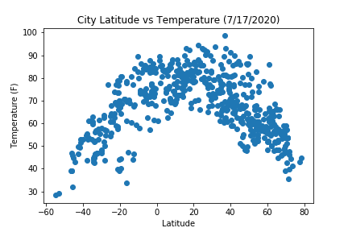
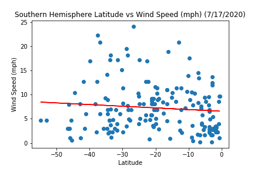

# Python Weather APIs #

### WeatherPy ###

I Created a Python script to visualize the weather of 500+ cities across the world of varying distance from the equator, utilizing CitiPy and the OpenWeatherMap API, and turned this data into a series of scatter plots:

- Temperature (F) vs. Latitude
- Humidity (%) vs. Latitude
- Cloudiness (%) vs. Latitude
- Wind Speed (mph) vs. Latitude

I then ran a linear regression on each relationship, separating them into Northern Hemisphere (greater than or equal to 0 degrees latitude) and Southern Hemisphere (less than 0 degrees latitude):

- Northern Hemisphere - Temperature (F) vs. Latitude
- Southern Hemisphere - Temperature (F) vs. Latitude
- ...
- Southern Hemisphere - Wind Speed (mph) vs. Latitude

The retrieved data is stored in output_data.csv, and the scatter plots can be found in the images folder as well as in the WeatherPy notebook with included commentary on possible linear relationships.

### VacationPy ###

In the VacationPy notebook, I created a heat map that displays the humidity for every city from the part I (WeatherPy), utilized pandas DataFrame filtration to find cities with ideal weather condition, used Google Places API to find the first hotel located within 5000 meters of those cities, and plotted the hotels on top of the humidity heatmap with each pin containing the hotel name, city, and country.

## Important! ##

To run the code, you will need all of the dependencies installed, as well as a key for the OpenWeatherMaps and Google gmaps APIs. Additionally, you will need to input these keys into the `w_api` and `g_api` variables in the config.py file in each folder.
